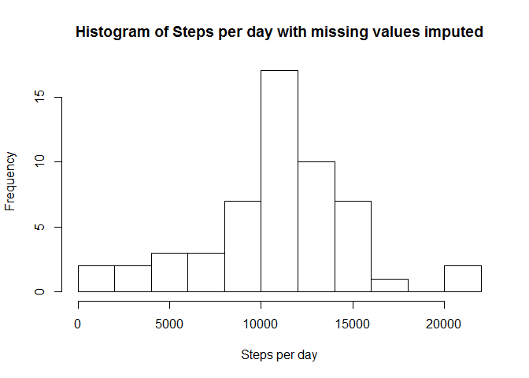

# Reproducible Research: Peer Assessment 1


### 1. Loading and preprocessing the data

Show any code that is needed to : 

- 1. Load the data

```r
activity <- read.csv(file='./activity.csv', stringsAsFactors = FALSE)
str(activity)
```

```
## 'data.frame':	17568 obs. of  3 variables:
##  $ steps   : int  NA NA NA NA NA NA NA NA NA NA ...
##  $ date    : chr  "2012-10-01" "2012-10-01" "2012-10-01" "2012-10-01" ...
##  $ interval: int  0 5 10 15 20 25 30 35 40 45 ...
```
- 2. Process/transform the data(if necessary) into a format suitable for your analysis

```r
activity$date <-  as.Date(activity$date, "%Y-%m-%d")
str(activity)
```

```
## 'data.frame':	17568 obs. of  3 variables:
##  $ steps   : int  NA NA NA NA NA NA NA NA NA NA ...
##  $ date    : Date, format: "2012-10-01" "2012-10-01" ...
##  $ interval: int  0 5 10 15 20 25 30 35 40 45 ...
```


### 2. What is mean total number of steps taken per day?

- 1. Calculate the total number of steps taken per day

```r
stepsperday = aggregate(activity$steps, by=list(Dates=activity$date), FUN=sum)
colnames(stepsperday) <- c('Date','StepsPerDay')
stepsperday
```

```
##          Date StepsPerDay
## 1  2012-10-01          NA
## 2  2012-10-02         126
## 3  2012-10-03       11352
## 4  2012-10-04       12116
## 5  2012-10-05       13294
## 6  2012-10-06       15420
## 7  2012-10-07       11015
## 8  2012-10-08          NA
## 9  2012-10-09       12811
## 10 2012-10-10        9900
## 11 2012-10-11       10304
## 12 2012-10-12       17382
## 13 2012-10-13       12426
## 14 2012-10-14       15098
## 15 2012-10-15       10139
## 16 2012-10-16       15084
## 17 2012-10-17       13452
## 18 2012-10-18       10056
## 19 2012-10-19       11829
## 20 2012-10-20       10395
## 21 2012-10-21        8821
## 22 2012-10-22       13460
## 23 2012-10-23        8918
## 24 2012-10-24        8355
## 25 2012-10-25        2492
## 26 2012-10-26        6778
## 27 2012-10-27       10119
## 28 2012-10-28       11458
## 29 2012-10-29        5018
## 30 2012-10-30        9819
## 31 2012-10-31       15414
## 32 2012-11-01          NA
## 33 2012-11-02       10600
## 34 2012-11-03       10571
## 35 2012-11-04          NA
## 36 2012-11-05       10439
## 37 2012-11-06        8334
## 38 2012-11-07       12883
## 39 2012-11-08        3219
## 40 2012-11-09          NA
## 41 2012-11-10          NA
## 42 2012-11-11       12608
## 43 2012-11-12       10765
## 44 2012-11-13        7336
## 45 2012-11-14          NA
## 46 2012-11-15          41
## 47 2012-11-16        5441
## 48 2012-11-17       14339
## 49 2012-11-18       15110
## 50 2012-11-19        8841
## 51 2012-11-20        4472
## 52 2012-11-21       12787
## 53 2012-11-22       20427
## 54 2012-11-23       21194
## 55 2012-11-24       14478
## 56 2012-11-25       11834
## 57 2012-11-26       11162
## 58 2012-11-27       13646
## 59 2012-11-28       10183
## 60 2012-11-29        7047
## 61 2012-11-30          NA
```

- 2. Make a histogram of the total number of steps taken each day

```r
hist(stepsperday$StepsPerDay, breaks = 10, xlab = 'Steps per day',
     main = paste("Histogram of Steps per day"))
```


- 3. Calculate and report the mean and median of the total number of steps taken per day


```r
meanSteps = mean(stepsperday$StepsPerDay, na.rm = TRUE)
medSteps = median(stepsperday$StepsPerDay, na.rm = TRUE)
```
Mean : 1.0766189\times 10^{4}  
Median : 10765

### 3. What is the average daily activity pattern?

- 1. Make a time series plot (i.e. type = "l") of the 5-minute interval (x-axis) and the average number of steps taken, averaged across all days (y-axis)


```r
dailyActivity = aggregate(activity$steps, by=list(intervals=activity$interval), FUN=mean, na.rm = TRUE)
colnames(dailyActivity) <- c('Interval','Steps')
head(dailyActivity)
```

```
##   Interval     Steps
## 1        0 1.7169811
## 2        5 0.3396226
## 3       10 0.1320755
## 4       15 0.1509434
## 5       20 0.0754717
## 6       25 2.0943396
```

```r
plot(dailyActivity$Interval, dailyActivity$Steps, type="l",
     xlab = 'Interval', ylab = 'Average Steps', main = 'Average daily activity pattern')
```


- 2. Which 5-minute interval, on average across all the days in the dataset, contains the maximum number of steps?


```r
dailyActivity[ dailyActivity$Steps == max(dailyActivity$Steps), ]
```

```
##     Interval    Steps
## 104      835 206.1698
```

### Imputing missing values

Note that there are a number of days/intervals where there are missing values (coded as NA). The presence of missing days may introduce bias into some calculations or summaries of the data.

- 1. Calculate and report the total number of missing values in the dataset (i.e. the total number of rows with NAs)


```r
na_count = sum(is.na(activity$steps))
na_count
```

```
## [1] 2304
```

- 2. Devise a strategy for filling in all of the missing values in the dataset. The strategy does not need to be sophisticated. For example, you could use the mean/median for that day, or the mean for that 5-minute interval, etc.

We use the mean for that 5-minute interval to replace the values


- 3. Create a new dataset that is equal to the original dataset but with the missing data filled in.


```r
na_index = is.na(activity$steps)
na_intervals = activity$interval[na_index]
replace_vals = dailyActivity$Steps[dailyActivity$Interval == na_intervals]
newactivity = activity
newactivity$steps[na_index] = replace_vals
head(newactivity)
```

```
##       steps       date interval
## 1 1.7169811 2012-10-01        0
## 2 0.3396226 2012-10-01        5
## 3 0.1320755 2012-10-01       10
## 4 0.1509434 2012-10-01       15
## 5 0.0754717 2012-10-01       20
## 6 2.0943396 2012-10-01       25
```


- 4. Make a histogram of the total number of steps taken each day and Calculate and report the mean and median total number of steps taken per day. Do these values differ from the estimates from the first part of the assignment? What is the impact of imputing missing data on the estimates of the total daily number of steps?


```r
newstepsperday = aggregate(newactivity$steps, by=list(Dates=newactivity$date), FUN=sum)
colnames(newstepsperday) <- c('Date','StepsPerDay')

# Make histogram
hist(newstepsperday$StepsPerDay, breaks = 10, , xlab = 'Steps per day',
     main = paste("Histogram of Steps per day with missing values imputed"))
```



```r
newmeanSteps = mean(newstepsperday$StepsPerDay, na.rm = TRUE)
newmedSteps = median(newstepsperday$StepsPerDay, na.rm = TRUE)
```

Old Mean : 1.0766189\times 10^{4}  
old Median : 10765

New Mean : 1.0766189\times 10^{4}  
New Median : 1.0765594\times 10^{4}

We observe that mean stays the same since we used the same mean of the overall dataset. However, the median increased. Since we replaced the missing values with averages, we reduced the skewness of the dataset, as we can observe from the fact that the median is closer to the mean now.


### Are there differences in activity patterns between weekdays and weekends?

For this part the weekdays() function may be of some help here. Use the dataset with the filled-in missing values for this part.

- 1. Create a new factor variable in the dataset with two levels - "weekday" and "weekend" indicating whether a given date is a weekday or weekend day.

We use the chron library to determine if the date is weekend or not


```r
library(chron)
isWeekend = is.weekend(newactivity$date)
newactivity$dateType = factor(isWeekend, labels = c("weekday", "weekend"))
head(newactivity)
```

```
##       steps       date interval dateType
## 1 1.7169811 2012-10-01        0  weekday
## 2 0.3396226 2012-10-01        5  weekday
## 3 0.1320755 2012-10-01       10  weekday
## 4 0.1509434 2012-10-01       15  weekday
## 5 0.0754717 2012-10-01       20  weekday
## 6 2.0943396 2012-10-01       25  weekday
```

- 2. Make a panel plot containing a time series plot (i.e. type = "l") of the 5-minute interval (x-axis) and the average number of steps taken, averaged across all weekday days or weekend days (y-axis). See the README file in the GitHub repository to see an example of what this plot should look like using simulated data.


```r
weekdayactivity = newactivity[newactivity$dateType == "weekday",]
weekendactivity = newactivity[newactivity$dateType == "weekend",]

# Compute the values for weekdays
dailyweekdayactivity = aggregate(weekdayactivity$steps, by=list(intervals=weekdayactivity$interval), FUN=mean, na.rm = TRUE)
colnames(dailyweekdayactivity) <- c('Interval','Steps')
dailyweekdayactivity$dateType = factor(rep(0,length(dailyweekdayactivity$Steps)), labels = "weekday")
head(dailyweekdayactivity)
```

```
##   Interval     Steps dateType
## 1        0 2.3179245  weekday
## 2        5 0.4584906  weekday
## 3       10 0.1783019  weekday
## 4       15 0.2037736  weekday
## 5       20 0.1018868  weekday
## 6       25 1.5273585  weekday
```

```r
# Compute the values for weekends
dailyweekendactivity = aggregate(weekendactivity$steps, by=list(intervals=weekendactivity$interval), FUN=mean, na.rm = TRUE)
colnames(dailyweekendactivity) <- c('Interval','Steps')
dailyweekendactivity$dateType = factor(rep(0,length(dailyweekendactivity$Steps)), labels = "weekend")
head(dailyweekendactivity)
```

```
##   Interval    Steps dateType
## 1        0 0.000000  weekend
## 2        5 0.000000  weekend
## 3       10 0.000000  weekend
## 4       15 0.000000  weekend
## 5       20 0.000000  weekend
## 6       25 3.714286  weekend
```

```r
# Combine the result
newdailyactivity = rbind(dailyweekdayactivity,dailyweekendactivity)
str(newdailyactivity)
```

```
## 'data.frame':	576 obs. of  3 variables:
##  $ Interval: int  0 5 10 15 20 25 30 35 40 45 ...
##  $ Steps   : num  2.318 0.458 0.178 0.204 0.102 ...
##  $ dateType: Factor w/ 2 levels "weekday","weekend": 1 1 1 1 1 1 1 1 1 1 ...
```

```r
# Plot the result
library(lattice)
xyplot(Steps~Interval | factor(dateType), data=newdailyactivity, 
                main="Average daily activity pattern", xlab="Interval",  ylab="Average Steps",layout=c(1,2),type='l')
```


